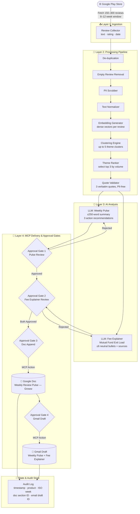
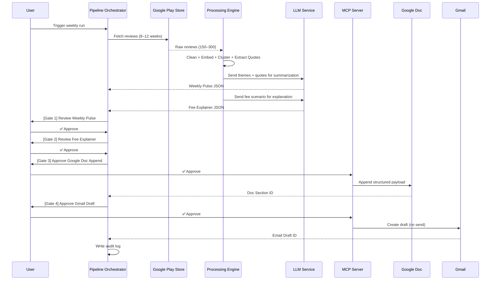

# Architecture: Groww Weekly Product Review Pulse & Fee Explainer

---

## 1. Architectural Goals

The system is designed around four core architectural principles:

| Principle | Implementation |
|---|---|
| **Human-in-the-loop** | All delivery actions require explicit user approval via MCP gates |
| **Separation of Concerns** | Data ingestion, AI analysis, and delivery are fully decoupled layers |
| **Idempotency** | Re-running for the same ISO week updates rather than duplicates |
| **Auditability** | Every pipeline run produces a complete, queryable audit trail |

---

## 2. System Layers Overview

The system is organized into four distinct architectural layers:

```
┌─────────────────────────────────────────────────────────┐
│                    INGESTION LAYER                       │
│         Google Play Store → Review Collector            │
├─────────────────────────────────────────────────────────┤
│                   PROCESSING LAYER                       │
│     Cleaning → Embedding → Clustering → Validation      │
├─────────────────────────────────────────────────────────┤
│                   AI ANALYSIS LAYER                      │
│      LLM Theme Summary → Quote Extraction → Actions     │
│      LLM Fee Explainer → Bullet Validation              │
├─────────────────────────────────────────────────────────┤
│                   DELIVERY LAYER (MCP)                   │
│   Approval Gate 1 → Gate 2 → Gate 3 → Gate 4            │
│   Google Doc Append (MCP) → Gmail Draft (MCP)           │
└─────────────────────────────────────────────────────────┘
```

---

## 3. Full System Flow Diagram



---

## 4. Layer-by-Layer Breakdown

### Layer 1 — Ingestion

**Responsibility:** Collect raw review data from the Google Play Store.

| Attribute | Detail |
|---|---|
| **Source** | Google Play Store (public reviews) |
| **Review Window** | Rolling 8–12 weeks |
| **Target Volume** | 150–300 reviews per cycle |
| **Fields Collected** | Review text, star rating (1–5), review date |

**Output:** Raw review records stored for downstream processing.

---

### Layer 2 — Processing Pipeline

**Responsibility:** Clean, enrich, and structure raw reviews for AI analysis.

#### 2.1 Data Cleaning Sub-pipeline

```
Raw Reviews
    │
    ├─► De-duplication          (remove identical / near-identical texts)
    │
    ├─► Empty Review Removal    (discard blank or whitespace-only entries)
    │
    ├─► PII Scrubber            (strip names, emails, phone numbers)
    │
    └─► Text Normalizer         (standardize encoding, punctuation, casing)
         │
         └─► Clean Review Corpus
```

#### 2.2 Embedding & Clustering Sub-pipeline

```
Clean Review Corpus
    │
    ├─► Embedding Generator     (dense vector per review)
    │
    ├─► Clustering Engine       (group semantically similar reviews)
    │       └─► Up to 5 clusters generated
    │
    ├─► Theme Ranker            (rank clusters by volume + business importance)
    │       └─► Top 3 themes selected
    │
    └─► Quote Validator
            ├─ Extract 3 verbatim quotes (one per theme)
            ├─ Confirm exact match in source review text
            └─ Confirm PII-free
```

**Expected Top Themes:**
1. **App Performance** — crashes, slow loads, UI bugs
2. **Withdrawal Experience** — delays, failures, unclear timelines
3. **Customer Support** — responsiveness, resolution quality

---

### Layer 3 — AI Analysis

**Responsibility:** Use LLMs to generate human-readable insights and fee explanations.

#### 3.1 Weekly Pulse Generation (Part A)

| Output | Specification |
|---|---|
| Weekly Summary | ≤250 words; top findings + sentiment overview |
| Customer Sentiment | Positive / Negative / Neutral distribution |
| Action Recommendations | Exactly 3 concrete improvement ideas |

**LLM:** [Groq](https://groq.com) — ultra-fast inference via GroqCloud API  
**Recommended Model:** `llama3-70b-8192` or `mixtral-8x7b-32768` via Groq  
**LLM Inputs:** Top 3 themes + ranked quotes + cluster size metadata  
**LLM Output:** Structured weekly pulse JSON → passed to Approval Gate 1

#### 3.2 Fee Explainer Generation (Part B)

| Output | Specification |
|---|---|
| Topic | Mutual Fund Exit Load |
| Format | Max 6 neutral bullet points |
| Tone | Factual only — no recommendations, no comparisons |
| Metadata | Source references + "Last Checked" date |

**LLM:** [Groq](https://groq.com) — same GroqCloud API endpoint  
**LLM Inputs:** Verified source URLs + fee scenario label  
**LLM Output:** Structured fee explainer JSON → passed to Approval Gate 2

---

### Layer 4 — MCP Delivery & Approval Gates

**Responsibility:** Enforce human approval before any external write action (Google Doc or Gmail).

> All delivery actions are performed exclusively through **an external, decoupled MCP (Model Context Protocol) server**. The backend interacts with the MCP Server deployed on Railway, and the MCP codebase is maintained independently in its own repository (`Bhavya_MCP_Server`). No direct Google Docs API or Gmail API calls are made anywhere in the system codebase.

#### Gate 1 — Weekly Pulse Review
```
Trigger:   LLM completes Part A generation
Presents:  Themes · Quotes · Weekly note · Action ideas
On ✅ Approve:  Proceed to Gate 2
On ❌ Reject:   Re-trigger LLM generation with feedback
```

#### Gate 2 — Fee Explainer Review
```
Trigger:   LLM completes Part B generation
Presents:  Explanation bullets · Source links · Last Checked date
On ✅ Approve:  Proceed to Gate 3
On ❌ Reject:   Re-trigger Fee Explainer generation
```

#### Gate 3 — Google Doc Append
```
Trigger:   Both Gate 1 and Gate 2 approved
MCP Action: Append to Google Doc "Weekly Review Pulse — Groww"

Payload:
{
  "date": "YYYY-MM-DD",
  "weekly_pulse": "...",
  "fee_scenario": "Mutual Fund Exit Load",
  "explanation_bullets": [ ... ],
  "source_links": [ ... ]
}

On ✅ Approve:  MCP appends/updates doc section → returns Doc Section ID
                Proceeds to Gate 4
On ❌ Reject:   Abort; no write to Google Doc
```

#### Gate 4 — Gmail Draft Creation
```
Trigger:   Gate 3 approved + Doc Section ID returned
MCP Action: Create Gmail draft (NEVER auto-sent)

Draft Subject: "Weekly Pulse + Fee Explainer — Groww"
Draft Body:
  - Weekly Pulse Summary
  - Fee Explainer Summary
  - Link to Google Doc section

On ✅ Approve:  Draft saved to Gmail → Email Draft ID stored in audit log
On ❌ Reject:   Draft discarded; workflow ends
```

---

## 5. State Management & Idempotency

The system maintains a **state store** to prevent duplicate report entries for the same review week.

### State Schema

```json
{
  "product_name": "Groww",
  "iso_week": "2026-W23",
  "doc_section_id": "section_abc123",
  "email_draft_id": "draft_xyz789",
  "status": "completed"
}
```

### Idempotency Logic

```
On Pipeline Trigger:
    1. Compute ISO Week from current date
    2. Query state store for (product_name, iso_week)
    
    IF record NOT found:
        → Run full pipeline
        → Create new doc section + email draft
        → Store new state record
    
    IF record FOUND:
        → Skip ingestion + AI generation (use cached outputs)
        → UPDATE existing doc section (Gate 3)
        → UPDATE existing email draft (Gate 4)
        → Overwrite state record with new IDs
```

---

## 6. Audit Log Schema

Every pipeline execution writes a complete audit entry:

```json
{
  "timestamp": "2026-06-08T16:00:00Z",
  "product": "Groww",
  "iso_week": "2026-W23",
  "generated_report": {
    "weekly_pulse": "...",
    "themes": ["App Performance", "Withdrawal Experience", "Customer Support"],
    "quotes": ["...", "...", "..."],
    "action_ideas": ["...", "...", "..."],
    "fee_explainer": {
      "scenario": "Mutual Fund Exit Load",
      "bullets": ["...", "...", "..."],
      "sources": ["...", "..."],
      "last_checked": "June 2026"
    }
  },
  "doc_section_id": "section_abc123",
  "email_draft_id": "draft_xyz789"
}
```

**Audit Query Capability:** The log enables answering —  
> *"What was sent, when, and for which week?"*

---

## 7. Component Interaction Diagram



---

## 8. Technology Stack

| Component | Technology / Approach |
|---|---|
| **Review Collection** | Google Play Store scraper / API (public reviews) |
| **Data Storage** | Local file store / lightweight DB for state + audit logs |
| **Embedding Generation** | [`BAAI/bge-large-en-v1.5`](https://huggingface.co/BAAI/bge-large-en-v1.5) via HuggingFace (1024-dim dense vectors) |
| **Embedding Runtime** | `sentence-transformers` library — runs locally, no external API needed |
| **Clustering** | k-means or DBSCAN on `BAAI/bge-large-en-v1.5` embeddings |
| **LLM Analysis** | [Groq](https://groq.com) — GroqCloud API for ultra-fast LLM inference |
| **Groq Model** | `llama3-70b-8192` (primary) / `mixtral-8x7b-32768` (fallback) |
| **Delivery Integration** | MCP (Model Context Protocol) server deployed to Railway (`https://bhavyamcpserver.up.railway.app`) |
| **Google Doc Integration** | Via Railway-hosted MCP Server — no direct Docs API |
| **Gmail Integration** | Via Railway-hosted MCP Server — no direct Gmail API |
| **Approval Interface** | MCP approval gates (interactive, user-driven) |

---

## 9. Key Design Decisions

| Decision | Rationale |
|---|---|
| **MCP over direct Google API** | Enforces human approval; removes direct credential dependency |
| **No auto-sending emails** | Preserves human oversight on all external communications |
| **Verbatim quote validation** | Prevents hallucinated quotes; ensures authenticity |
| **Max 5 clusters, surface top 3** | Balances signal depth with stakeholder readability |
| **Idempotency via ISO Week key** | Safe re-runs without creating duplicate reports |
| **PII scrubbing before LLM input** | Protects user privacy before any AI processing |
| **Decoupled Part A and Part B** | Pulse and Fee Explainer can be reviewed and approved independently |
| **Audit log on every run** | Full traceability for compliance and debugging |

---

## 10. Failure & Fallback Scenarios

| Failure Point | Behaviour |
|---|---|
| Review fetch fails | Pipeline aborts; no partial run stored; user notified |
| LLM generation fails | Gate not presented; error surfaced to user for retry |
| User rejects at Gate 1 or 2 | LLM re-runs with optional user feedback |
| User rejects at Gate 3 | No write to Google Doc; workflow halts cleanly |
| User rejects at Gate 4 | Doc appended but no email draft; audit log records partial completion |
| Duplicate ISO week detected | System enters update mode; no new records created |
